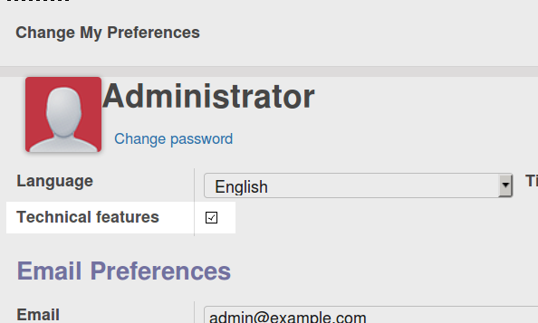

   :target: http://www.gnu.org/licenses/agpl-3.0-standalone.html
   :alt: License: AGPL-3

Access to technical features without activating debug mode
==========================================================

In Odoo 9.0, the debug mode grants every employee user access to the technical
features. This module enables persistent access to technical features based on
user preference.

Installation
------------

Configuration
-------------

After installation of this module, every employee can still access technical
features for the applications that they have access to by enabling debug mode.
Additionally, users can check the *Technical feature* field in their
preferences to gain permanent access to the menus and views that fall under
this category.

Upon installation of this module, this preference is already
set for the administrator user of the database.

In the background, this preference is mapped to the *Technical feature (w/o
debug mode)* group that this module adds. As an administrator, you can
therefore manage this preference from the regular Users and Groups menu items.

Usage
-----

=====

.. image:: https://odoo-community.org/website/image/ir.attachment/5784_f2813bd/datas
   :alt: Try me on Runbot
   :target: https://runbot.odoo-community.org/runbot/149/9.0

Known issues / Roadmap
----------------------

Bug Tracker
-----------

Bugs are tracked on `GitHub Issues
<https://github.com/OCA/server-tools/issues>`_. In case of trouble, please
check there if your issue has already been reported. If you spotted it first,
help us smashing it by providing a detailed and welcomed `feedback
<https://github.com/OCA/
server-tools/issues/new?body=module:%20
base_technical_features%0Aversion:%20
9.0%0A%0A**Steps%20to%20reproduce**%0A-%20...%0A%0A**Current%20behavior**%0A%0A**Expected%20behavior**>`_.

Credits
-------

Images

* Odoo Community Association: `Icon <https://github.com/OCA/maintainer-tools/blob/master/template/module/static/description/icon.svg>`_.

### Contributors

* Stefan Rijnhart <stefan@opener.am>

### Funders

### Maintainer

.. image:: https://odoo-community.org/logo.png
   :alt: Odoo Community Association
   :target: https://odoo-community.org

This module is maintained by the OCA.

OCA, or the Odoo Community Association, is a nonprofit organization whose
mission is to support the collaborative development of Odoo features and
promote its widespread use.

To contribute to this module, please visit https://odoo-community.org.

[//]: # (copyright)

----

**Odoo** is a trademark of [Odoo S.A.](https://www.odoo.com/) (formerly OpenERP, formerly TinyERP)

**OCA**, or the [Odoo Community Association](http://odoo-community.org/), is a nonprofit organization whose
mission is to support the collaborative development of Odoo features and
promote its widespread use.

**zeroincombenze®** is a trademark of [SHS-AV s.r.l.](http://www.shs-av.com/)
which distributes and promotes **Odoo** ready-to-use on its own cloud infrastructure.
[Zeroincombenze® distribution](http://wiki.zeroincombenze.org/en/Odoo)
is mainly designed for Italian law and markeplace.
Everytime, every Odoo DB and customized code can be deployed on local server too.

[//]: # (end copyright)

[//]: # (addons)

[//]: # (end addons)

